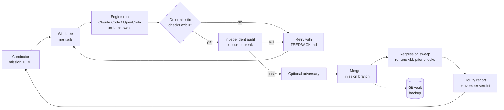

# Platform Map

Orientation for new operators (and future agents). One section per top-level
directory: what it is, the load-bearing files, and how it connects. Generated
from the actual tree, 2026-07-11.

## The mission loop at a glance

Best-of-N variant: attempt 1 spawns N independent candidate worktrees; checks
gate each; the auditor picks the winner (`best_of_n` task field).

## bin/

The operator/agent toolbelt. `oracle` (bash) and `oracle.ps1` (PowerShell) are
the platform CLIs — serving, missions, IDE, vault, viewers, loops, notes.
`trace.py` queries engine session logs (list/show/diff/grep). `checkpoint`
commits + ledgers in one step (with a 50 MB blob guard). `envoy-fetch` /
`envoy-discover` are the only network-touching tools, used by the envoy role.
`session-journal.js` maintains per-session memory via Claude Code hooks.

## bootstrap/

Install and lifecycle. `install.sh` is the Mac one-time bootstrap;
`ensure-tools.ps1|.sh` self-provisions the toolbelt (a missing tool is a task,
not a blocker); `doctor.sh` / `doctor.ps1` are the read-only diagnostics;
`download-models.ps1|.sh` fetch pinned GGUFs; `render-config.sh` +
`serving/serve-windows.ps1` render llama-swap configs; `sync-skills.ps1|.sh`
link `skills/` into both engines; `vault.sh|.ps1` manage the offline git vault;
`build-installers.ps1` produces the double-clickable installers; `envoy.sh`
opens controlled network windows.

## bench/

The frontier-parity measuring instrument. `PROTOCOL.md` is pre-registered
(V5): the tracked metric is LIFT = harnessed − raw pass rate. `run.py` runs
reference / placebo calibration (must be 12/12 and 0/12) and the scored raw /
harnessed modes. `tasks/t01..t12` each carry PROMPT.md + test.py +
reference.py. Results append to `RESULTS.jsonl`.

## conductor/

The self-governing loop. `conductor.py` implements missions: task DAGs,
worktrees, the verification stack (checks → audit → tiebreak → adversary),
retry-with-feedback, best-of-N tournaments, escalation, watchdogs, INFRA
strike refunds, singleton lock, hourly reports, the overseer, lessons
distillation, and the retrospective that proposes governed amendments.
`console.py` is the mission-control web UI (:8800). `missions/*.toml` are
mission definitions; `tests/` is the loop's own regression net (43 tests:
parsing, mission loading, trace CLI, offline end-to-end smoke).

## connectors/

Everything the engines plug into. `mcp.claude.json` (DuckDB + Postgres MCP),
`mcp.agent-mcp.json` (optional orchestration server), `net-allowlist.txt` +
`discovery-blocklist.txt` (envoy policy), `supabase/` (self-hosted compose),
`gitea/` (vault web UI), and `ide/` — the Cursor-parity IDE: `setup-ide.ps1|.sh`
(VSCodium + Continue + Kilo), `sync-models.ps1|.sh` (machine-wide model
auto-detection: rewires Continue, Kilo, engine tiers, and OpenCode's model map
on every launch), `agent-tab.ps1|.sh` (terminal agents, optional worktrees),
`oracle-agents/` (the Agents sidebar extension: conversations with live
thinking, mission status, session journals), `pack-extension.ps1` (VSIX build).

## engines/

The two agent engines, fully repo-contained. `claude-code/` (CLAUDE.md,
settings.json with hooks + permissions, `home/agents/` personas: researcher,
developer, auditor, adversary, librarian) and `opencode/` (opencode.json,
AGENTS.md, `agent/` personas incl. envoy). `shared/` is the doctrine both
load: CONVENTIONS.md (operating rules), AUTONOMY.md (the long-horizon
protocol + amendment log), SEED-BRAIN.md (founding memory: ~112 principles
with stable IDs, NEW PRINCIPLES, errata), IDE-AGENT.md, ENVOY.md.

## harness/

Vendored, pinned third-party layers (all in `VERSIONS.lock`): `ecc/` (curated
skill subset), `skill-packs/` (superpowers `sp-*` + gstack `gs-*`, 67 skills),
`agent-mcp/` (optional orchestration viewer, loopback-only),
`loop-engineering/` (patterns + the loop-audit/init/cost/sync CLIs). Vendor
checkouts are gitignored; installers re-materialize them from pins.

## serving/

Local inference. `models.manifest` (pinned ensemble + slots + sampling),
`profiles.conf` (hardware-adaptive profiles), `serve-windows.ps1` and
`service.sh` + `render-config.sh` (llama-swap on 127.0.0.1:9099 with KV
prefix-cache reuse, OpenAI-compat aliases, hardware-adaptive placement),
`tiers.env` (opus/sonnet/haiku → actual models; auto-written).

## skills/

First-party skill packs (SKILL.md each): quant research, trading systems,
financial engineering, data science, ML, stochastic + statistical modeling,
Rust/C++ quant, Supabase/Postgres, loop-engineering. Synced into both engines
by `sync-skills`; third-party packs live under `harness/`.

## memory/ (runtime, gitignored)

The plain-text brain: LEDGER.md (append-only event journal), STATE.md
(generated snapshot), FAILURES.md (failure memory, M3 incident format),
LESSONS.md (Layer-1 distilled experience), PROCESS.jsonl (structured loop
telemetry), AMENDMENTS.md + APPROVALS.md (governed evolution),
NET-REQUESTS.md (envoy queue), `sessions/` (per-session journals). Layer 0 is
`engines/shared/SEED-BRAIN.md` — lessons that generalize get promoted there.

## Everything else

`reports/` (hourly + final mission reports), `logs/` (engine session
transcripts — the trace store), `docs/` (decision records 0001-0004,
meta-analyses, this map), `state/` (pids + locks), `models/` (GGUF weights),
`env/` (uv-managed quant Python), `desk/` (Rust desktop app, optional),
`LOOP.md` (loop inventory + budgets + kill switches), `AGENTS.md` (working
rules for any agent in this repo), `VERSIONS.lock` (every pin).
